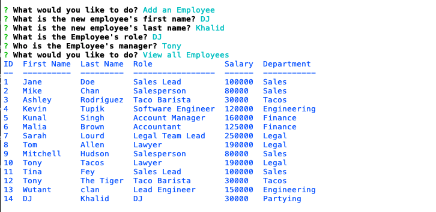
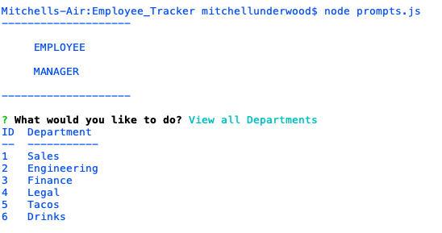

# Employee_Manager 
 
### Description 
 A CLI tool to create, view, and update employees, roles, and departments within your organization. The tool manages a database with information on employee's salary, managers, departmental information and more. 

### Demo

For a link to a video demonstration of the application, click [here](./index.html)

### Table of Contents 
- [**Description**](#Description) 
- [**Installation**](#Installation) 
- [**Usage**](#Usage) 
- [**License**](#License) 
- [**Contributing**](#Contributing) 
- [**Tests**](#Tests) 
- [**Questions**](#Questions)
### Installation 
 Fork the repo, run 'npm i' and then 'node prompts.js' 
### Usage 
 NA 
### License 
This project is covered under the MIT license. 
### Contributing 
 NA 
### Tests 
 NA 
### Questions 

For additional projects and materials, go to ***[github.com/sassypigeon](https://github.com/sassypigeon)***. 
For additional questions, email me at ***mitchellmunderwood@gmail.com*** 

### Images

